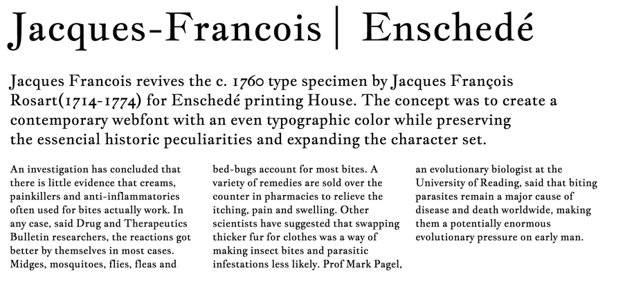

#### Jacques Francois Open-Source Font

Jacques Francois revives the c. 1760 type specimen 
by Jacques François Rosart(1714-1774) for Enschedé 
printing House. The concept was to create a contemporary 
webfont with an even typographic color while preserving 
the essencial historic peculiarities and expanding
the character set.

Jacques Francois is designed for medium to small sizes.
For this purpose its features were altered: contrast was
lowered and and x-height significantly increased. 
Designed by Manvel Shmavonyan, Alexei Vanyashin.
Jacques Francois includes oldstyle figures.

Jacques Francois is a Unicode typeface family that supports 
languages that use the Latin script and its variants, and 
could be expanded to support other scripts.

